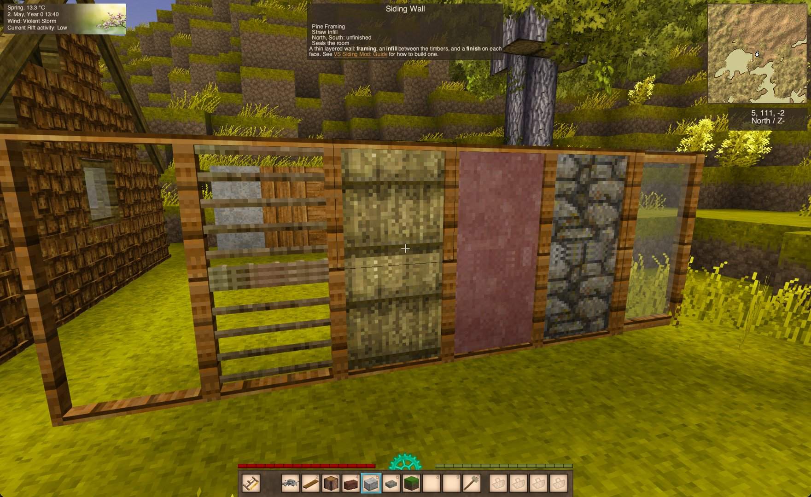
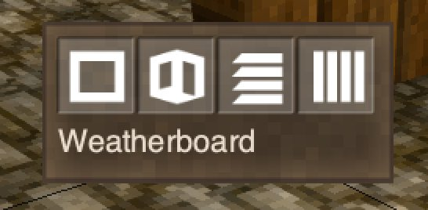
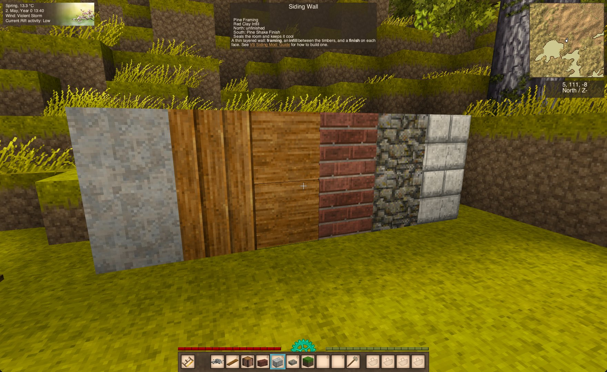
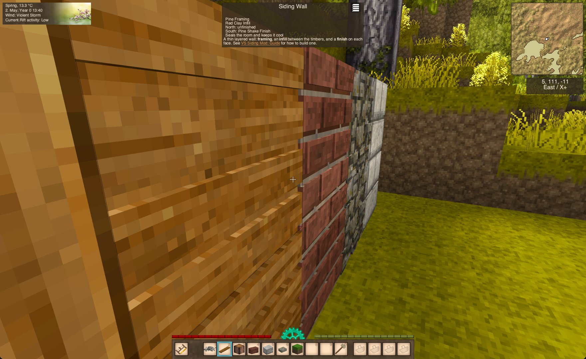
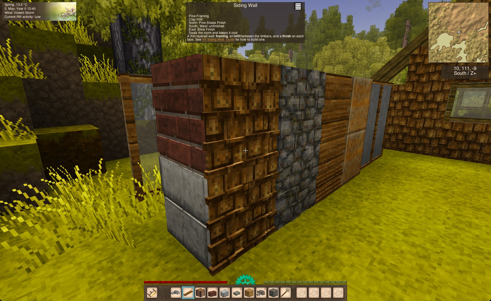
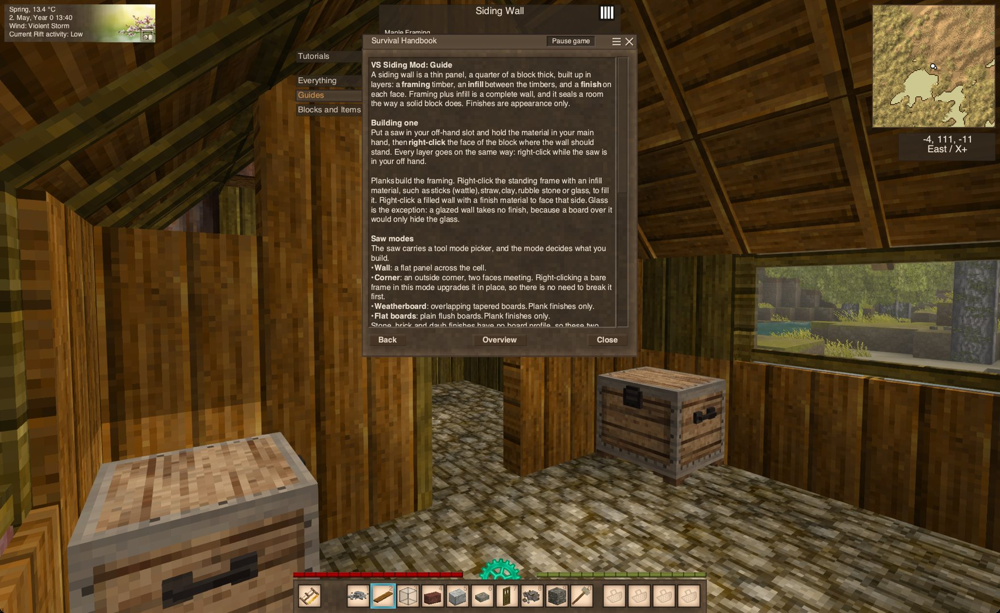

# Siding - Layered Wall Building for Vintage Story

A Vintage Story mod that replaces solid one-block walls with a thin, layered wall system: pick a framing material, an infill material, and a finish for each face, and build walls that read like actual construction instead of a stack of full blocks.

Inspired by how the [Roofing](https://mods.vintagestory.at/show/mod/30143) mod handles pitched roofs: one shared shape, material swapped in via config, instead of hand-authoring every combination.

## Building a wall

Put a saw in your off-hand slot, hold the material in your main hand, and right-click.
Every layer goes on the same way: planks raise the framing, an infill fills it, a finish faces each side.

The saw carries a tool mode picker, and the mode decides what you build: a flat **wall**, an outside **corner**, overlapping **weatherboard**, or flush **flat boards**.
The in-game handbook page *VS Siding Mod: Guide* has the whole thing.

## What a wall is made of

- **Framing**: planks, in any wood the game has.
- **Infill**: wattle, straw, clay, rubble stone or glass.
- **Finish**: appearance only, per face, in wood, clay, brick or stone.

Framing plus infill is a complete wall, and seals a room the way solid blocks do.
The infill decides whether it counts as a cooling (cellar) wall: rubble stone and clay do, wattle and straw do not.
Glass seals the same way but lets daylight through.

## Screenshots

The framing:


Saw Mode picker:


The finishes:




Handbook:


---

## Building from Source

```bash
./build.sh
```

Requires the `VINTAGE_STORY` environment variable to point at your Vintage Story install (or a `Directory.Build.props.user` copied from `Directory.Build.props.user.example`).

## License

[MIT](./LICENSE)
